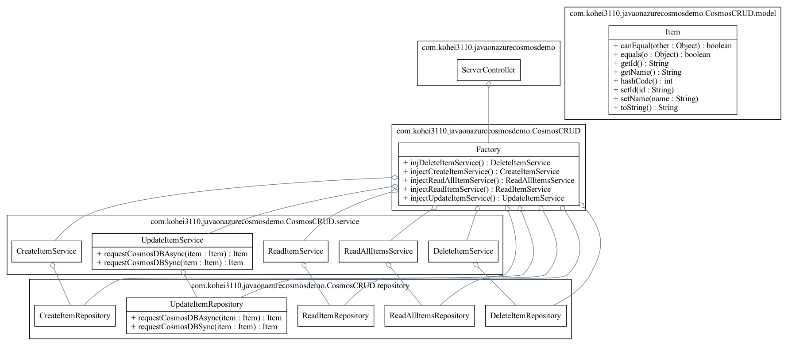

# Java on Azure Cosmos DB

## アーキテクチャ

## デプロイ方法

- 上図の Azure リソースデプロイ方法

    - 以下のボタンをクリックするだけ

## Azure でのアプリケーション実行方法

###  GitHub シークレットに以下の値を入力

| Key | Value |
| :--- | :--- |
| `AZURE_WEBAPP_PUBLISH_PROFILE_DEV` | Azureの**開発**環境にアプリケーションやサービスをデプロイする際に使用する情報や設定を含む値。 |
| `AZURE_WEBAPP_PUBLISH_PROFILE_PROD` | Azureの**本番**環境にアプリケーションやサービスをデプロイする際に使用する情報や設定を含む値。 |
| `COSMOSDB_ENDPOINT_DEV` | **開発**環境にデプロイされた Cosmos DB エンドポイント |
| `COSMOSDB_ENDPOINT_PROD` | **本番**環境にデプロイされた Cosmos DB エンドポイント |
| `COSMOSDB_KEY_DEV` | **開発**環境にデプロイされた Cosmos DB プライマリキー |
| `COSMOSDB_KEY_PROD` | **本番**環境にデプロイされた Cosmos DB プライマリキー |

参考: 

* [リポジトリに暗号化されたシークレットを作成する](https://docs.github.com/ja/actions/security-guides/encrypted-secrets#creating-encrypted-secrets-for-a-repository)

* [Azure App Service から発行プロファイルを取得する](https://docs.microsoft.com/ja-jp/visualstudio/azure/how-to-get-publish-profile-from-azure-app-service?view=vs-2022)

### App Service に環境変数を設定

| Key | Value |
| :--- | :--- |
| `COSMOSDB_ENDPOINT_DEV` | **開発**環境にデプロイされた Cosmos DB エンドポイント |
| `COSMOSDB_ENDPOINT_PROD` | **本番**環境にデプロイされた Cosmos DB エンドポイント |
| `COSMOSDB_KEY_DEV` | **開発**環境にデプロイされた Cosmos DB プライマリキー |
| `COSMOSDB_KEY_PROD` | **本番**環境にデプロイされた Cosmos DB プライマリキー |

Refs: [App Service アプリを構成する](https://docs.microsoft.com/ja-jp/azure/app-service/configure-common?tabs=portal)

## UML 図

